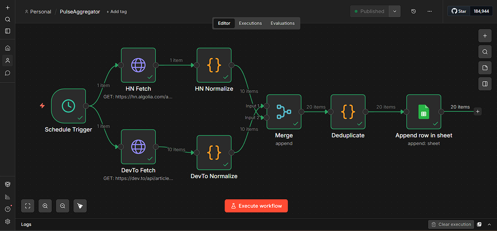
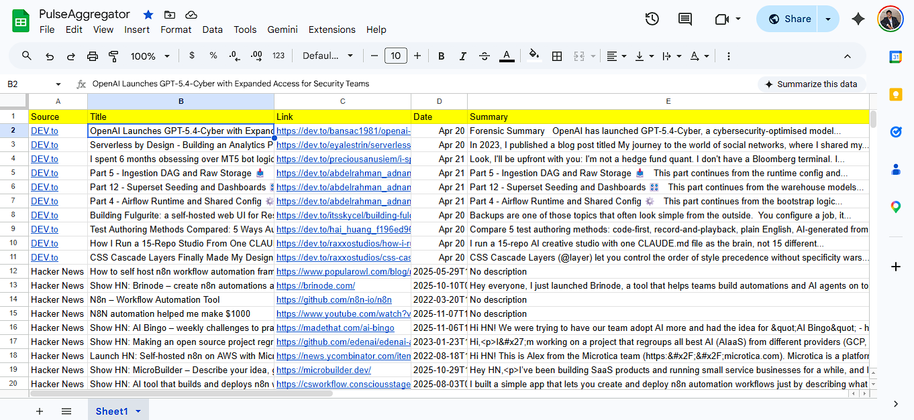

# PulseAggregator — Keyword Intelligence Pipeline

An automated n8n workflow that aggregates daily keyword mentions from DEV.to and Hacker News, deduplicates results, and writes structured data to Google Sheets — replacing 2 hours of manual research with a zero-touch scheduled pipeline.

## Live Demo
[View Live Google Sheet Output](https://docs.google.com/spreadsheets/d/1uhExVk1xix_2YrWEP-mtOK6QrZKCDA2iamcyoDE9-X8/edit?usp=sharing)

## Workflow Overview

## Output Preview

## How It Works
1. Schedule Trigger fires every day at 9 AM automatically
2. Fetches latest articles from DEV.to API (tag: automation)
3. Fetches latest posts from Hacker News Algolia API (query: n8n automation)
4. Normalizes both sources into a unified data structure
5. Merges and deduplicates entries by URL fingerprinting
6. Appends clean rows to Google Sheets: Source, Title, Link, Date, Summary

## Tech Stack
- n8n (workflow automation)
- DEV.to Public API (no auth required)
- Hacker News Algolia API (no auth required)
- Google Sheets API (OAuth2)

## Sources
| Source | Endpoint | Auth |
|--------|----------|------|
| DEV.to | api/articles?tag=automation | None |
| Hacker News | hn.algolia.com/api/v1/search | None |

## Output Columns
| Column | Description |
|--------|-------------|
| Source | DEV.to or Hacker News |
| Title | Article/post title |
| Link | Direct URL to content |
| Date | Publication date |
| Summary | First 150 chars of description |

## Business Problem Solved
A marketing agency was spending 2+ hours every morning manually searching multiple platforms, copy-pasting results into a spreadsheet, and removing duplicates by hand. PulseAggregator eliminates this entirely — runs on its own, zero human involvement needed.

## Setup Instructions
1. Import `PulseAggregator.json` into your n8n instance
2. Connect your Google Sheets OAuth2 credential
3. Update the Document ID in the Google Sheets node to your own sheet
4. Activate the workflow
5. Done — runs automatically every day at 9 AM

## What I Learned
- n8n workflow building from scratch (first time using n8n)
- Connecting OAuth2 credentials in n8n
- Working with public REST APIs without authentication
- Data normalization and deduplication logic in n8n Code nodes
- Google Sheets API integration via n8n

## If I Had More Time
- Add more sources: Product Hunt, LinkedIn, Twitter/X RSS
- Add AI-generated summary using free Groq API
- Send daily email digest with top 5 results
- Add keyword filtering to remove irrelevant results

## License
MIT License — Subham Paul (Rex)
